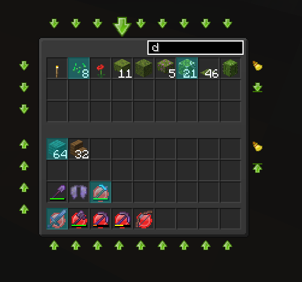
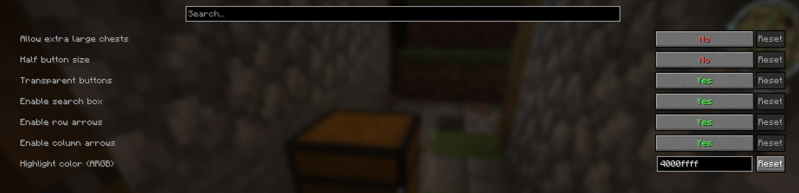

# Chestifier

A Fabric mod that adds quality-of-life buttons and shortcuts to chest, shulker box,
and inventory screens: sorting, moving matching stacks, and searching.

Chestifier is a continuation of [EasierChests](https://www.curseforge.com/minecraft/mc-mods/easierchests)
by Giselbaer ([gbl](https://github.com/gbl)), which is end of life and no
longer updated. It's built with his blessing to keep the mod alive on current
Minecraft versions and add new features.

## Screenshots

Row and column arrows around a chest, with the search box active:



Config screen (via Mod Menu + Cloth Config):



## Features

- Move a whole row or column of items between your inventory and a chest with one click
- Move all items from your inventory into a chest that already has a matching stack (and back)
- Sort a chest's contents, or your own inventory
- Search box to highlight matching items in a chest by name
- Freeze individual inventory slots (middle-click) so sorting/moving skips them
- Configurable via [Mod Menu](https://modrinth.com/mod/modmenu) + [Cloth Config](https://modrinth.com/mod/cloth-config)
- All actions can be bound to hotkeys

Works on multiplayer servers too, as long as they don't restrict inventory
actions via anti-cheat plugins. No server-side plugin required.

## Requirements

- [Fabric Loader](https://fabricmc.net/)
- [Fabric API](https://modrinth.com/mod/fabric-api)
- [Mod Menu](https://modrinth.com/mod/modmenu) (optional, for the config screen)

Chestifier is developed on a separate branch per supported Minecraft
version. See [docs/VERSIONING.md](docs/VERSIONING.md) for the branch
naming scheme, which versions are currently supported, and the release
process.

## Building from source

```
./gradlew build
```

The built jar will be in `build/libs/`.

## Credits

- Original mod design and implementation: Giselbaer ([gbl/EasierChests](https://github.com/gbl/EasierChests))
- Chestifier continuation: [alinou](https://github.com/Alin0u)

## License

MIT, see [LICENSE](LICENSE).
